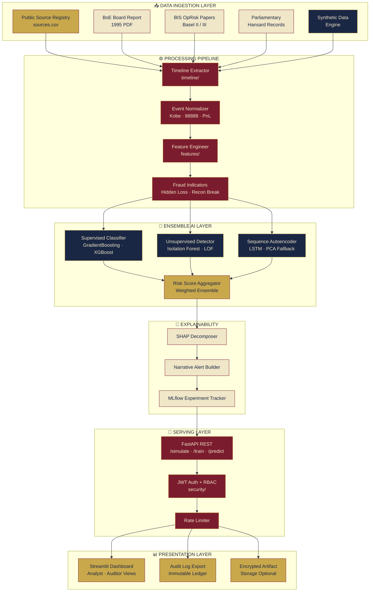
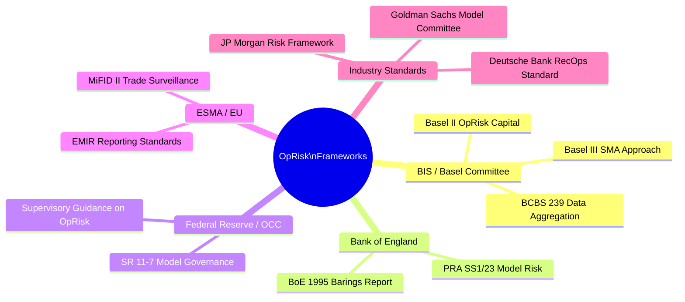
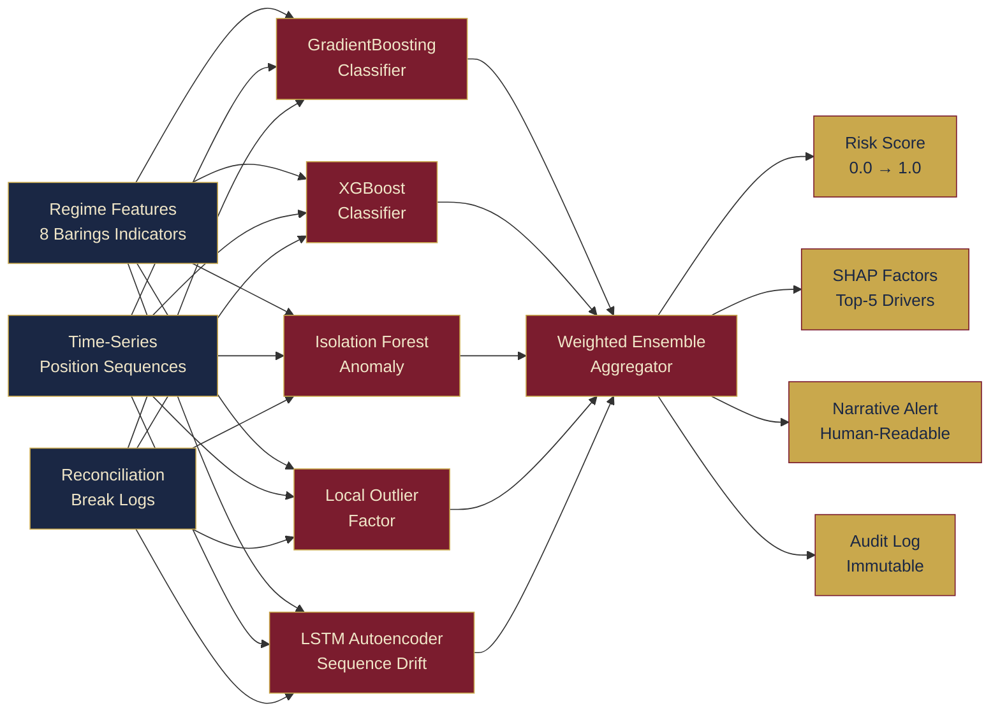

<div align="center">

<!-- ═══════════════════════════════════════════════════════════════════ -->
<!--                        BANNER PRINCIPAL                           -->
<!-- ═══════════════════════════════════════════════════════════════════ -->


<!-- ═══════════════════════════════════════════════════════════════════ -->
<!--                      TYPING ANIMATION                             -->
<!-- ═══════════════════════════════════════════════════════════════════ -->

<a href="https://git.io/typing-svg">
  
</a>

<br/>

<!-- ═══════════════════════════════════════════════════════════════════ -->
<!--                     SHIELDS — ROW 1: STACK                        -->
<!-- ═══════════════════════════════════════════════════════════════════ -->

[](https://python.org)
[](https://fastapi.tiangolo.com)
[](https://streamlit.io)
[](https://scikit-learn.org)

<!-- ═══════════════════════════════════════════════════════════════════ -->
<!--                     SHIELDS — ROW 2: OPS                          -->
<!-- ═══════════════════════════════════════════════════════════════════ -->

[](https://mlflow.org)
[](#)
[](https://jwt.io)
[](https://docker.com)

<!-- ═══════════════════════════════════════════════════════════════════ -->
<!--                     SHIELDS — ROW 3: COMPLIANCE                   -->
<!-- ═══════════════════════════════════════════════════════════════════ -->

[](#)
[](#)
[](#)
[](#)

<!-- ═══════════════════════════════════════════════════════════════════ -->
<!--                     SHIELDS — ROW 4: STATUS                       -->
<!-- ═══════════════════════════════════════════════════════════════════ -->

[](#)
[](#)
[](#)
[](#)
[](#)

<br/>

> **"It's not a loss until you close the position."**
> — Nick Leeson, *Rogue Trader*, 1996
>
> *£827 million in hidden losses. One account. Zero oversight. The fall of the world's oldest merchant bank.*

<br/>

</div>

---

## ⚑ Overview

**Barings Bank OpRisk Intelligence** is a modular research prototype that reconstructs the operational control failures and rogue trading behaviors that led to the **1995 collapse of Barings Bank** — the world's oldest British merchant bank, founded in 1762 and trusted custodian for the British Royal Family.

Using exclusively **public-domain sources** and **fully synthetic trading data**, this platform ingests historical facts, reconstructs the event timeline, simulates hidden-loss desk behavior, engineers domain-specific fraud features, and trains an ensemble of supervised, unsupervised, and sequence-anomaly models. Results are exposed through a **production-grade FastAPI backend** and an interactive **Streamlit analyst dashboard**.

This platform applies the same operational risk detection principles used by **Tier-1 global institutions** — JP Morgan Chase's model risk governance (SR 11-7), Deutsche Bank's front-to-back reconciliation standards, and the BIS Basel Committee's OpRisk Standardized Measurement Approach — to one of history's most forensically documented trading disasters.

---

## 🏛️ Historical Context

```
╔══════════════════════════════════════════════════════════════════════════════╗
║              BARINGS BANK — INSTITUTIONAL TIMELINE                          ║
║              Founded 1762  ·  Collapsed February 26, 1995                   ║
╠══════════════════════════════════════════════════════════════════════════════╣
║                                                                              ║
║  1762  ──  Francis Baring founds the bank in London                         ║
║  1803  ──  Finances Louisiana Purchase for the United States government      ║
║  1890  ──  First Barings Crisis: Argentine sovereign debt bailout by         ║
║            Bank of England consortium (£17M, ~£2.3B today)                  ║
║  1989  ──  Nick Leeson joins Barings as a settlements clerk                  ║
║  1992  ──  Leeson posted to Singapore as general manager of SIMEX ops        ║
║  1992  ──  Error Account 88888 opened — officially for client errors         ║
║  1993  ──  Account 88888 repurposed to conceal unauthorized positions        ║
║  1994  ──  Hidden losses reach £50M — reported as £28.5M profit to London   ║
║  Jan 1995 ─ Kobe earthquake triggers Nikkei 225 freefall, losses explode    ║
║  Feb 23   ─ Leeson flees Singapore; losses total £827M (£1.6B today)        ║
║  Feb 26   ─ Barings declared insolvent; Bank of England confirms no bailout  ║
║  Mar 1995 ─ ING Group acquires Barings for £1 (one pound sterling)           ║
║  1995  ──  Bank of England publishes the Board of Banking Supervision report ║
║  1999  ──  Basel Committee codifies OpRisk as a standalone risk category     ║
║                                                                              ║
╚══════════════════════════════════════════════════════════════════════════════╝
```

### Why This Case Matters for Modern Risk Management

The Barings collapse is cited in virtually every major operational risk framework produced since 1995:

| Framework | Institution | Barings Reference |
|-----------|-------------|-------------------|
| **Basel II / Basel III** | Bank for International Settlements | OpRisk capital charge design |
| **SR 11-7 Model Risk** | Federal Reserve / OCC | Validation governance gaps |
| **BCBS 239** | Basel Committee | Aggregation & reporting failures |
| **PRA Supervisory Statements** | Bank of England | Fit & proper management |
| **MiFID II Trade Surveillance** | ESMA | Front-office booking controls |
| **JP Morgan Chase Risk Framework** | JPMorgan | Dual reporting lines, VaR limits |
| **Goldman Sachs Risk Committee** | Goldman Sachs | Independent risk oversight |

---

## 🧩 What This Platform Covers

| Module | Description |
|--------|-------------|
| 📚 **Public-Source Registry** | Curated provenance for BoE reports, parliamentary material, BIS commentary, SIMEX filings, press archives, and academic analysis |
| 🕰️ **Timeline Reconstruction** | Event normalization around Leeson, Account `88888`, control failures, and the Kobe earthquake macro-shock |
| 🧪 **Synthetic Data Engine** | Realistic trading, position, cashflow, reconciliation, and audit logs across four behavioral regimes |
| 🔬 **Fraud Feature Engineering** | Barings-specific indicators: hidden-loss usage, PnL vs. cash mismatch, funding spikes, reconciliation breaks, front/back office overlap |
| 🤖 **Ensemble AI Models** | Supervised classifiers, unsupervised anomaly detection, and sequence autoencoder for behavioral drift |
| 📊 **Risk Scoring & Explainability** | SHAP-powered factor decomposition, narrative alerts, and audit-grade logging |
| 🔐 **Security Layer** | JWT authentication, RBAC, rate limiting, and optional encrypted artifact storage |
| 🖥️ **REST API + Dashboard** | FastAPI for programmatic access, Streamlit for analyst and auditor workflows |

---

## 📐 System Architecture



---

## 🧪 Behavioral Simulation Regimes

The synthetic data engine generates four distinct behavioral regimes that mirror the documented progression of the Barings collapse:

```
┌─────────────────────────────────────────────────────────────────────────────┐
│  REGIME            │  ANALOG                  │  KEY INDICATORS             │
├────────────────────┼──────────────────────────┼─────────────────────────────┤
│  healthy_desk      │  Barings 1989–1992        │  Clean PnL, reconciled,     │
│                    │  Pre-Singapore era        │  normal margin calls        │
├────────────────────┼──────────────────────────┼─────────────────────────────┤
│  mild_anomaly      │  Early Leeson 1992–1993   │  Small breaks, minor        │
│                    │  First 88888 entries      │  funding irregularities     │
├────────────────────┼──────────────────────────┼─────────────────────────────┤
│  rogue_trader      │  Leeson 1993–1994         │  Hidden loss acceleration,  │
│                    │  Straddle strategy        │  recon failures, PnL spoof  │
├────────────────────┼──────────────────────────┼─────────────────────────────┤
│  collapse          │  January–Feb 1995         │  Margin spiral, funding     │
│                    │  Kobe earthquake shock    │  crisis, full cascade       │
└─────────────────────────────────────────────────────────────────────────────┘
```

---

## 🔬 Fraud Feature Engineering

The platform engineers Barings-specific indicators grounded in the **Bank of England Board of Banking Supervision Report (1995)** and BIS OpRisk literature:

```
╔══════════════════════════════════════════════════════════════════════╗
║  FEATURE CATEGORY         │  BARINGS ANALOG                         ║
╠══════════════════════════════════════════════════════════════════════╣
║  hidden_loss_ratio        │  Account 88888 usage intensity          ║
║  pnl_cash_divergence      │  Reported profit vs. cash withdrawal    ║
║  funding_spike_index      │  Margin call escalation pattern         ║
║  recon_break_frequency    │  SIMEX vs. Barings London mismatch      ║
║  front_back_overlap_score │  Leeson dual role: trading + settlement ║
║  position_size_drift      │  Nikkei 225 futures concentration       ║
║  options_straddle_decay   │  Short volatility bleed after Kobe      ║
║  audit_response_lag       │  London queries ignored for 7+ weeks    ║
╚══════════════════════════════════════════════════════════════════════╝
```

---

## 🏗️ Repository Layout

```text
barings-oprisk-platform/
│
├── app/
│   ├── api/                    # FastAPI app, auth, endpoints, bootstrap
│   │   ├── main.py             # Application entry point
│   │   ├── auth.py             # JWT + RBAC
│   │   ├── endpoints/          # simulate, train, predict, alerts
│   │   └── bootstrap.py        # Demo model training + sample alerts
│   │
│   ├── dashboard/              # Streamlit analyst interface
│   │   └── app.py
│   │
│   ├── data/
│   │   ├── raw/
│   │   │   └── public/         # barings_public_extracts.json + provenance
│   │   ├── clean/              # Versioned processed datasets
│   │   ├── synthetic/          # Regime-labeled trading simulation output
│   │   └── schemas/            # Pydantic + JSON Schema definitions
│   │
│   ├── ingestion/              # Source loaders, parsers, deduplication
│   ├── timeline/               # Event extraction, normalization
│   ├── features/               # Feature engineering pipeline
│   ├── models/                 # Ensemble: supervised + unsupervised + seq
│   ├── simulation/             # Synthetic data generation engine
│   ├── security/               # Encryption, vault integration
│   ├── utils/                  # Logging, config, versioning
│   ├── tests/                  # Pytest suite
│   ├── docs/
│   │   ├── architecture.md     # Full architecture + data flow diagrams
│   │   ├── threat_model.md     # Adversarial & insider threat model
│   │   └── timeline.md         # Annotated Barings timeline
│   ├── configs/                # YAML environment configs
│   └── reports/                # Versioned alert and model outputs
│
├── sources.csv                 # Curated public-source provenance registry
├── model_card.md               # Model documentation (SR 11-7 aligned)
├── data_card.md                # Dataset documentation
├── .env.example
├── pyproject.toml
└── README.md
```

---

## ⚡ Quick Start

### Prerequisites

```bash
# Python 3.12 environment
python -m venv .venv && source .venv/bin/activate

# Install platform
pip install -e .

# Configure environment
cp .env.example .env
```

### Bootstrap Demo

```bash
# Train demo model + generate sample alerts
python -m app.api.bootstrap
```

### Launch Services

```bash
# Terminal 1 — REST API
uvicorn app.api.main:app --reload

# Terminal 2 — Analyst Dashboard
streamlit run app/dashboard/app.py
```

---

## 🔌 API Reference

### Authentication

```bash
curl -X POST http://localhost:8000/auth/token \
  -H "Content-Type: application/json" \
  -d '{"username":"admin","password":"admin123"}'
```

### Simulate a Scenario

```bash
curl -X POST http://localhost:8000/simulate \
  -H "Authorization: Bearer <TOKEN>" \
  -H "Content-Type: application/json" \
  -d '{"scenario":"collapse","days":90,"seed":7}'
```

> Mirrors the January–February 1995 Kobe-shock cascade: accelerating Nikkei 225 short exposure, margin calls exceeding £800M, and reconciliation failure across 14 London control checks.

### Train Ensemble

```bash
curl -X POST http://localhost:8000/train \
  -H "Authorization: Bearer <TOKEN>" \
  -H "Content-Type: application/json" \
  -d '{
    "scenarios": ["healthy_desk","mild_anomaly","rogue_trader","collapse"],
    "days_per_scenario": 120
  }'
```

### Score a Scenario

```bash
curl -X POST http://localhost:8000/predict \
  -H "Authorization: Bearer <TOKEN>" \
  -H "Content-Type: application/json" \
  -d '{"scenario":"rogue_trader","days":60,"seed":13}'
```

---

## 🏦 Regulatory Alignment

This platform is designed with reference to the following frameworks as they apply to operational risk detection and model governance:



---

## 🤖 Model Architecture



---

## 🔐 Security Architecture

```
┌─────────────────────────────────────────────────────────────────────┐
│  SECURITY LAYER                                                      │
├──────────────────────┬──────────────────────────────────────────────┤
│  Authentication      │  JWT Bearer — HS256, configurable expiry     │
│  Authorization       │  RBAC — analyst / auditor / admin roles      │
│  Rate Limiting       │  Per-endpoint token bucket                   │
│  Artifact Storage    │  AES-256 encrypted (optional HashiCorp Vault)│
│  Audit Logging       │  Append-only, tamper-evident JSON-L          │
│  Data Provenance     │  SHA-256 hash per public source record       │
│  Synthetic Isolation │  No real PII, positions, or client data      │
└──────────────────────┴──────────────────────────────────────────────┘
```

---

## 📊 Public-Source Design

The platform ships with a curated `sources.csv` registry and a normalized fact corpus at `app/data/raw/public/barings_public_extracts.json`. Every record preserves:

| Field | Description |
|-------|-------------|
| `source_id` | Canonical identifier |
| `title` | Publication title |
| `institution` | Issuing body (BoE, BIS, SFC, SIMEX) |
| `date` | Publication or coverage date |
| `url` | Canonical or archived URL |
| `reliability` | Tier-1 official / Tier-2 academic / Tier-3 press |
| `note` | Short paraphrased extract — no copyrighted bulk text |
| `sha256` | Record integrity hash |

The ingestion layer is designed so new PDFs or HTML can be added without modifying the downstream pipeline.

---

## 🧪 Testing

```bash
# Full test suite
pytest

# With coverage report
pytest --cov=app --cov-report=html

# Specific modules
pytest app/tests/test_features.py
pytest app/tests/test_simulation.py
pytest app/tests/test_api.py
```

---

## 📌 Optional Dependencies

| Library | Function | Fallback |
|---------|----------|----------|
| `shap` | Gradient-based feature attribution | Deterministic local explainability |
| `mlflow` | Experiment tracking & model registry | File-based versioned experiment logs |
| `tensorflow` | LSTM sequence autoencoder | PCA reconstruction anomaly score |
| `xgboost` | Gradient boosting classifier | Scikit-learn GradientBoostingClassifier |

---

## 📂 Documentation Index

| Document | Contents |
|----------|----------|
| [`app/docs/architecture.md`](app/docs/architecture.md) | Full system architecture, data flow, component contracts |
| [`app/docs/threat_model.md`](app/docs/threat_model.md) | Adversarial & insider threat model, STRIDE analysis |
| [`app/docs/timeline.md`](app/docs/timeline.md) | Annotated Barings event timeline with source citations |
| [`model_card.md`](model_card.md) | Model documentation aligned to SR 11-7 / EU AI Act |
| [`data_card.md`](data_card.md) | Dataset documentation, lineage, and synthetic schema |

---

## ⚙️ Environment Variables

```bash
# .env.example

APP_SECRET_KEY=change-me-in-production
JWT_ALGORITHM=HS256
JWT_EXPIRY_MINUTES=60

ADMIN_USERNAME=admin
ADMIN_PASSWORD=admin123

MLFLOW_TRACKING_URI=./app/reports/mlruns
ARTIFACT_ENCRYPTION=false
VAULT_ADDR=http://127.0.0.1:8200

LOG_LEVEL=INFO
RATE_LIMIT_PER_MINUTE=60
```

---

## 🗺️ Roadmap

```
[v1.0]  ████████████████████████░░  Core prototype complete
[v1.1]  ██████████░░░░░░░░░░░░░░░░  Real-time streaming via Kafka
[v1.2]  ████████░░░░░░░░░░░░░░░░░░  Graph anomaly — desk network topology
[v1.3]  ██████░░░░░░░░░░░░░░░░░░░░  LLM-powered narrative audit reports
[v2.0]  ████░░░░░░░░░░░░░░░░░░░░░░  Multi-case: BCCI, Société Générale, Kweku
[v2.1]  ██░░░░░░░░░░░░░░░░░░░░░░░░  Regulatory API submission layer (FCA/PRA)
```

---

## 📜 License & Ethics

This repository is released under the **MIT License**.

All historical references are drawn from **public-domain sources** including the Bank of England, BIS, SIMEX, and parliamentary records. No proprietary trading data, client records, or unpublished materials are used. All trading simulation is **fully synthetic** and generated programmatically with no connection to any institution's real positions.

This platform is intended strictly for **research, education, and risk management system development**.

---

<div align="center">


**Built with rigor. Grounded in public record. Designed to prevent the next Barings.**

[](https://github.com/maykonlincolnusa)

*"Those who cannot remember the past are condemned to repeat it."*
*— George Santayana · Applied to Banking Risk since 1995*

</div>
